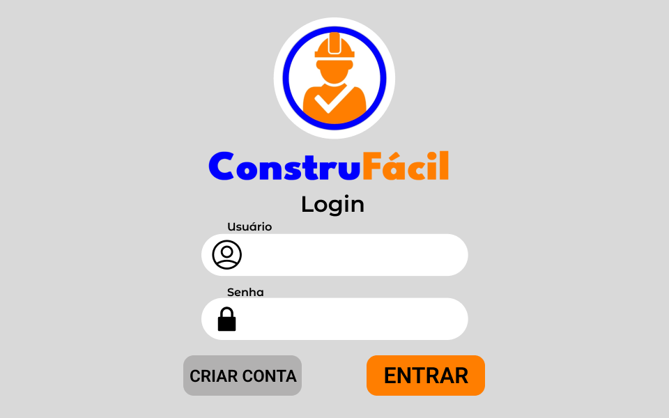
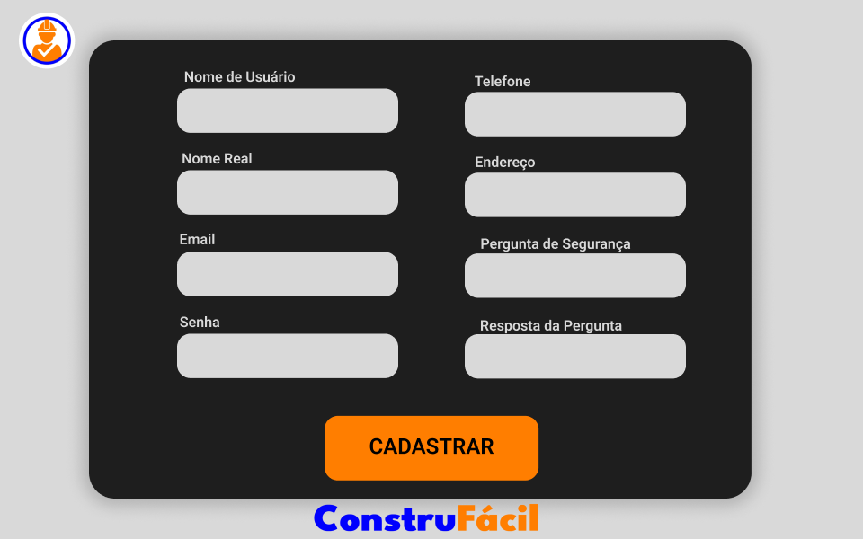
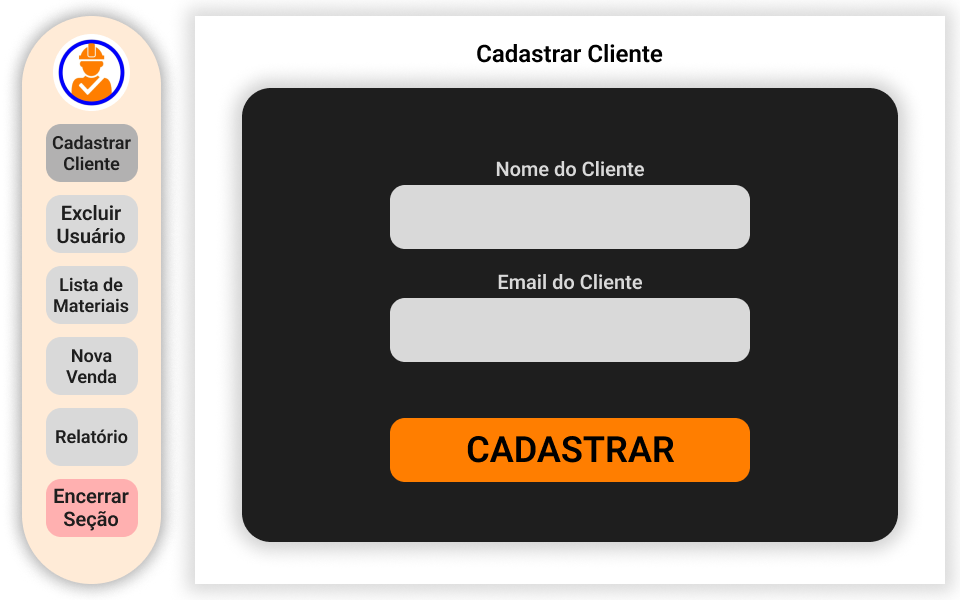
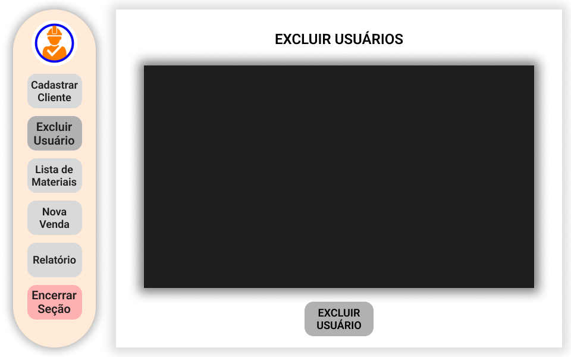
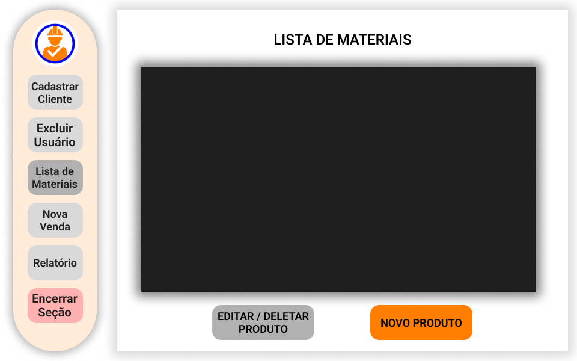
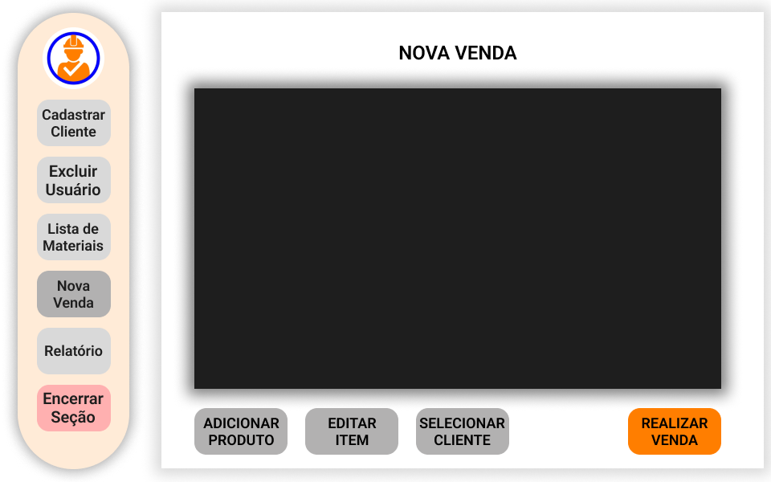
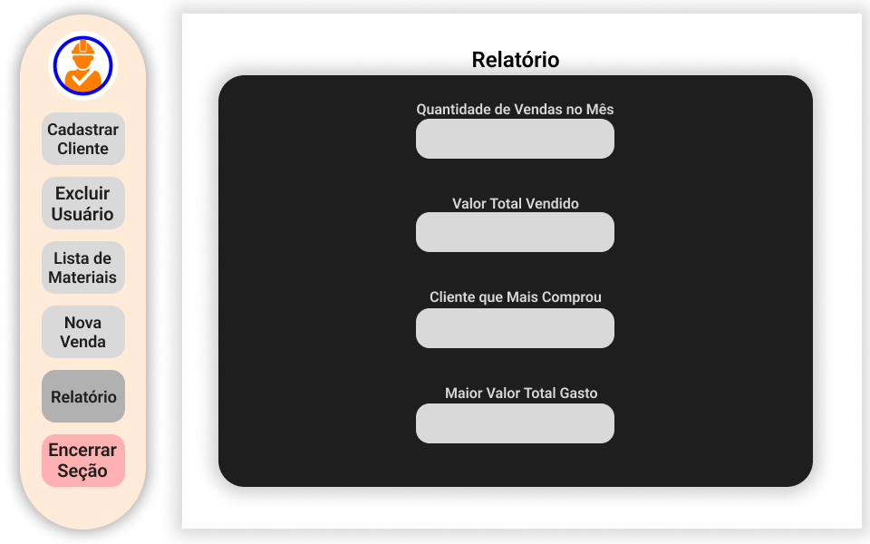

# Manual do Usuário - Sistema de Gerenciamento de Estoque

Bem-vindo ao sistema de gerenciamento de estoque! Este manual tem como objetivo ajudá-lo a usar o aplicativo e entender suas funcionalidades.

---

Índice
1. Visão Geral
2. Requisitos do Sistema
3. Login no Sistema
4. Funcionalidades Principais
- Cadastro de Produtos
- Edição de Produtos
- Exclusão de Produtos
- Visualização de Produtos
- Nova Venda
- Relatórios

5. Encerramento da Sessão

---

## Visão Geral

O aplicativo é projetado para gerenciar o estoque de uma empresa, permitindo o cadastro, edição, exclusão e visualização de produtos, além de registrar vendas e gerar relatórios.

### Interface Principal

Menu Lateral: Localizado à esquerda, contém os botões para acessar as funcionalidades.

Área de Trabalho: Exibe tabelas, formulários e janelas para as operações escolhidas.

Barra Superior: Exibe o título da tela ativa.

---

## Requisitos do Sistema

Sistema Operacional: Windows, macOS ou Linux.

Java: Versão 11 ou superior instalada.

Banco de Dados: MySQL com a base de dados configurada.

---

# Login no Sistema

1. Ao iniciar o aplicativo, você verá a tela de login.
2. Insira seu nome de usuário e senha.
3. Clique no botão Entrar.
4. Se as credenciais estiverem corretas, você será redirecionado para a tela principal.

´Nota: Em caso de erro de login, verifique suas credenciais ou entre em contato com o administrador do sistema.´

Caso queira cadastrar, clique em ´Criar Conta´ e preencha os campos necessários

---

# Funcionalidades Principais

## Cadastro de Cliente

No botão ´Cadastrar Cliente´ no painel lateral, você irá colocar o nome do cliente e o email de contato. Após isso, ao clicar no botão ´CADASTRAR´, vai ser registrado esse cliente na lista de clientes para registrar a venda (Vamos ver isso mais para frente).

## Exlcuir Usuários

Aqui você irá excluir os usuários que podem fazer login no sistema. Ao clicar em ´Excluir Usuário´ no painel lateral, você irá selecionar o usuário que você queira excluir e, ao apertar ´Excluir Usuário´, vai aparecer uma janela de confirmação e, caso aceitar, o usuário irá ser deletado do banco de dados.

## Cadastro de Produtos

Dentro do menu ´Lista de Materiais´, você vai ver uma lista de materiais disponíveis dividido em ´Código´, ´Descrição´, ´Quantidade´ e ´Preço Unitário´. Ao clicar em ´Novo Produto´, uma janela irá abrir para inserir manualmente o código do produto, a descrição, a quantidade disponível e o preço unitário.

## Edição e Remoção de Produtos

Na mesma tela que a anterior, ao clicar em ´Editar / Deletar Produtos´, irá aparecer uma janela com as informações do produto selecionado. Caso queira alterar algo, aprenas modifique os valores e clique em salvar. Caso queira deletar o produto da lista, aperte o botão deletar.

## Nova Venda

Aqui, ao clicar em ´Adicionar Produto´, selecione o produto que queira vender informando a quantidade. Então, esse produto irá aparecer em uma tabela acima contendo o "Carrinho de compras". Caso queira editar a quantidade ou o valor do item selecionado, clique em ´Editar Item´, altere a quantidade ou o valor unitário e clique em salvar. Ao lado, irá ter uma caixa de seleção para selecionar o cliente que está realizando a venda. Após finalizar essas etapas, clique em ´Realizar Venda´.

## Relatórios

Aqui irá ficar a quantidade de vendas feitas no mês, além de mostrar o cliente que mais comprou, o maior valor gasto e o total de dinehiro movimentado

## Encerramento da Sessão

1. Clique no botão Encerrar Sessão no menu lateral.
2. Confirme a saída na mensagem exibida.
3. Você será redirecionado para a tela de login.
